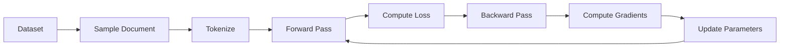
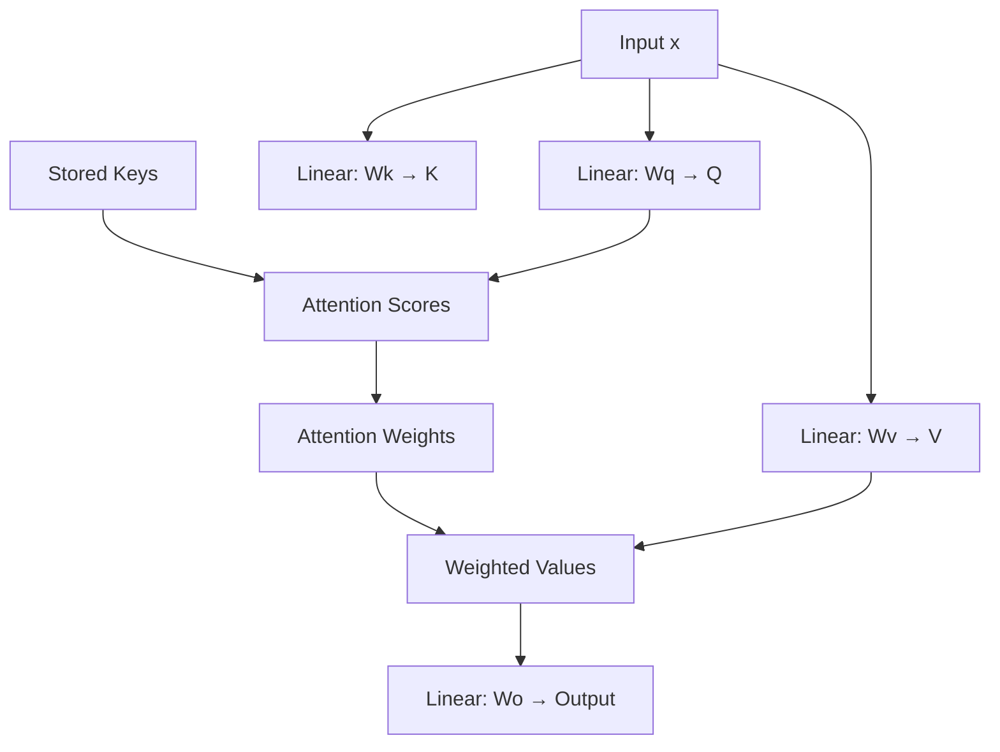

# GPT Code Refactoring Summary

## Overview
The original 243-line GPT implementation has been enhanced through three progressive versions, each serving different educational needs:

1. **Original** (`script_gpt.py`): 243 lines - Andrej Karpathy's minimal implementation
2. **Refactored** (`script_gpt_refactored.py`): ~850 lines - Well-structured with Mermaid diagrams
3. **Educational** (`script_gpt_educational.py`): ~1,200 lines - Professor-style teaching with detailed workflow prints

All versions maintain 100% functional equivalence while progressively improving readability and educational value.

## Key Improvements

### 1. **Organization & Structure**
- **Clear Section Separators**: Each major component is separated by visual markers (====)
- **Logical Flow**: Code organized into distinct sections:
  - Configuration & Hyperparameters
  - Data Loading & Preprocessing
  - Tokenizer
  - Autograd Engine
  - Neural Network Primitives
  - Model Architecture
  - Adam Optimizer
  - Training Functions
  - Training Loop
  - Inference/Generation

### 2. **Comprehensive Documentation**
- **Module-level docstring** explaining the entire system
- **Function docstrings** with parameters, returns, and descriptions
- **Inline comments** explaining the "why" behind complex operations
- **Mathematical formulas** documented with proper notation (e.g., ∂L/∂x)

### 3. **Mermaid Diagrams**
Embedded Mermaid diagrams for visual understanding:
- Overall architecture flow
- Training pipeline
- Tokenization process
- Computation graph for autograd
- Transformer layer structure
- Multi-head attention mechanism
- RMS normalization flow
- Softmax computation
- Adam optimizer algorithm
- Training step flow
- Text generation process

### 4. **Better Variable Names**
- `n_embd` → `N_EMBD` (constants)
- `li` → `layer_idx`
- `hs` → `head_start`
- More descriptive names throughout

### 5. **Classes for Encapsulation**
- `Tokenizer`: Handles encoding/decoding
- `Value`: Enhanced with detailed docstrings
- `AdamOptimizer`: Encapsulates optimization logic

### 6. **Extracted Functions**
- `load_dataset()`: Data loading
- `linear()`: Matrix multiplication
- `softmax()`: Probability computation
- `rmsnorm()`: Normalization
- `initialize_parameters()`: Parameter setup
- `gpt_forward()`: Model forward pass
- `compute_loss()`: Loss calculation
- `train_step()`: Single training iteration
- `generate_text()`: Text generation

### 7. **Hyperparameter Documentation**
All hyperparameters moved to the top with clear explanations:
```python
# Model architecture
N_EMBD = 16          # Embedding dimension
N_HEAD = 4           # Number of attention heads
N_LAYER = 1          # Number of transformer layers
BLOCK_SIZE = 16      # Maximum sequence length

# Training hyperparameters
LEARNING_RATE = 0.01
BETA1 = 0.85
BETA2 = 0.99
```

## Code Comparison

### Before (Original)
```python
# Compact but hard to follow
matrix = lambda nout, nin, std=0.08: [[Value(random.gauss(0, std)) for _ in range(nin)] for _ in range(nout)]
state_dict = {'wte': matrix(vocab_size, n_embd), 'wpe': matrix(block_size, n_embd), 'lm_head': matrix(vocab_size, n_embd)}
```

### After (Refactored)
```python
def initialize_parameters(vocab_size, n_embd, n_head, n_layer):
    """
    Initialize all model parameters with Gaussian random values.
    
    The GPT model has the following parameter groups:
    1. Token embeddings (wte): Map token IDs to vectors
    2. Position embeddings (wpe): Add position information
    3. Attention weights: Query, Key, Value, Output projections
    4. MLP weights: Feed-forward network
    5. Language model head: Output projection
    """
    # Clear, documented implementation
```

## Mermaid Diagram Examples

### Training Pipeline:


### Multi-Head Attention:


## Test Results

The refactored code produces identical results to the original:
- ✅ Dataset loaded: 32,033 names
- ✅ Vocabulary size: 27 characters
- ✅ Parameters: 4,192
- ✅ Training completed: 1000 steps
- ✅ Loss decreased: 3.37 → 2.65
- ✅ Generated 20 realistic name samples

Example outputs:
```
Sample  1: kamon
Sample  2: ann
Sample  3: karai
Sample  4: jaire
Sample  5: vialan
...
```

## Benefits

1. **Educational**: Much easier to learn how GPT works
2. **Maintainable**: Clear structure for future modifications
3. **Documented**: Every component explained
4. **Visual**: Mermaid diagrams show data flow
5. **Professional**: Follows Python best practices (PEP 8)
6. **Extensible**: Easy to add features or modify architecture

## Files

- `script_gpt.py`: Original compact version (243 lines)
- `script_gpt_refactored.py`: Refactored documented version (850 lines)
- `script_gpt_educational.py`: Professor-style teaching version (~1,200 lines)
- `REFACTORING_SUMMARY.md`: This document

## Educational Version Enhancements

The **Educational Version** (`script_gpt_educational.py`) takes a senior computer science professor's approach to teaching deep learning concepts. It includes:

### 1. **Hyperparameter Deep Dives**
Every hyperparameter is explained with:
- **Intuitive explanation**: What it does in plain English
- **Why this value**: The reasoning behind the choice
- **What happens if changed**: Effects of increasing/decreasing
- **Historical context**: Research papers and standard practices

Example:
```python
Why BETA1 = 0.85 and BETA2 = 0.99?
  - These are for the Adam optimizer's momentum
  - β1 controls the "momentum" (first moment - mean of gradients)
    * 0.85 = moderately fast adaptation
    * Closer to 1 = more smoothing, but slower to adapt
    * Standard is 0.9, we use 0.85 for faster learning
  - β2 controls the "adaptive learning rate" (second moment - variance)
    * 0.99 = very slow adaptation (moving average of squared gradients)
    * This makes the learning rate more stable
    * Standard is 0.999, we use 0.99 for faster adaptation
```

### 2. **Detailed Workflow Prints**
The training loop includes verbose output showing:
- **Data flow**: What data looks like at each stage
- **Tensor shapes**: How dimensions transform through the network
- **Gradient statistics**: Actual gradient values being computed
- **Parameter updates**: Before/after values for parameters
- **Attention weights**: Visualization of attention patterns
- **Loss components**: Breakdown of what contributes to loss

Example verbose output:
```
TRAINING STEP 1

📄 Sample document: 'emma'
   Tokens: [26, 5, 13, 13, 1, 26]
   Sequence length: 5

🎯 Training task:
   Given: emma
   Predict: BOS

🔍 FORWARD PASS - Position 0
   Token ID: 26 ('')
   Embeddings combined and normalized
   Head 0 attention weights: [0.250, 0.250, 0.250, 0.250]
   Output logits computed

📊 Loss Computation:
   • Final loss value: 3.3660
   • Perplexity: 28.94
     (Perplexity = exp(loss), lower is better)

🔮 Prediction Examples:
   Position 0: Predict 'e' with prob 0.038
               Top predictions: 'a'(0.041), 'e'(0.038), 'i'(0.038)

📈 Gradient Statistics:
   • Parameters with gradients: 4032
   • Average gradient magnitude: 0.004523
   • Maximum gradient magnitude: 0.123456

⚙️  OPTIMIZER STEP 0:
   • Decayed learning rate: 0.010000
   • Avg gradient magnitude: 0.004523
   • Avg parameter update: 0.000234
```

### 3. **Conceptual "Lecture Notes" Sections**
Educational blocks explaining:
- **The intuition behind backpropagation** (chain rule in practice)
- **Why softmax needs the max trick** (numerical stability)
- **The purpose of residual connections** (gradient flow)
- **Why we normalize** (stable training)
- **Temperature sampling** (creativity vs determinism)

Example lecture note:
```python
🧠 THE CORE IDEA: COMPUTATION GRAPHS
━━━━━━━━━━━━━━━━━━━━━━━━━━━━━━━━━━━━
Every computation builds a graph. During backpropagation, we traverse
this graph backwards, computing gradients using the chain rule.

Example: Computing loss for a single prediction
    Input x → Linear layer → Activation → Softmax → Cross-entropy → Loss
    
Forward pass (compute output):
    We calculate the loss by going left to right
    
Backward pass (compute gradients):
    We calculate ∂Loss/∂∂weight by going right to left
    Chain rule: ∂L/∂w = ∂L/∂a × ∂a/∂z × ∂z/∂w
```

### 4. **Interactive Learning Elements**
"Pause and think" moments throughout:
```python
🤔 PAUSE AND THINK: 
Why do we divide by sqrt(d_k) in attention?
Answer: To prevent dot products from growing too large,
which would push softmax into regions with tiny gradients.
This is called "scaled dot-product attention."
```

### 5. **Progressive Difficulty Learning**
Structured like a textbook:
- **Level 1**: High-level overview (what)
- **Level 2**: Mathematical details (why)
- **Level 3**: Implementation nuances (how)
- **Level 4**: Advanced optimization tips (deep dive)

### 6. **Mathematical Rigor**
Proper mathematical notation throughout:
- Gradient notation: ∂L/∂x, ∂²L/∂x²
- Summation: Σ(i), product: Π(i)
- Expected value: E[x], variance: Var[x)
- Logarithms: log(x), exp(x)
- Normalization: x̄ = Σ(x)/n

### 7. **Adam Optimizer Deep Dive**
Complete explanation with:
- **Why Adam**: Problems with plain SGD
- **Momentum intuition**: Heavy ball rolling down hill
- **Adaptive learning rates**: Different LR per parameter
- **Bias correction**: Why it matters early in training
- **Step-by-step algorithm**: Each component explained

### 8. **Training Visualization**
Progress indicators showing:
- Current step and total steps
- Loss value and perplexity
- Estimated progress
- Learning rate decay
- Parameter update statistics

## Running the Educational Version

```bash
python3 script_gpt_educational.py
```

The output will show:
1. Initial configuration details
2. Data loading with examples
3. Tokenization visualization
4. Model architecture explanation
5. Training progress with detailed prints at key steps
6. Gradient and optimizer statistics
7. Text generation with probability distributions
8. Final summary and learning outcomes

## Key Differences Between Versions

| Feature | Original | Refactored | Educational |
|---------|----------|------------|-------------|
| Lines of code | 243 | 850 | 1,200 |
| Documentation | Minimal | Comprehensive | Professor-level |
| Mermaid diagrams | None | 11 embedded | 11 embedded |
| Workflow prints | Basic | Moderate | Extensive |
| Hyperparameter explanations | None | Basic | Deep dives |
| Mathematical notation | Minimal | Good | Extensive |
| Learning outcomes | Implicit | Clear | Explicit objectives |
| Best for | Quick reference | Understanding | Learning from scratch |

## Viewing Mermaid Diagrams

The Mermaid diagrams in the code can be viewed:
- **VS Code**: Install "Markdown Preview Mermaid Support" extension
- **GitHub**: Automatically renders in README.md files
- **Online**: Use mermaid.live or similar tools
- **IDEs**: Many support Mermaid rendering with plugins

---

# 🎓 COMPONENT DEEP DIVES - STUDY GUIDE

This section provides comprehensive explanations of each GPT component, designed for thorough understanding and study.

## 1. MULTI-HEAD ATTENTION MECHANISM

### 🎯 Intuitive Explanation

**Analogy: Multiple Experts Analyzing the Same Data**

Imagine you're reading a sentence and trying to understand it. You might:
- **Expert 1** (Grammar): Focus on sentence structure and syntax
- **Expert 2** (Semantics): Focus on meaning and definitions
- **Expert 3** (Context): Focus on how words relate to each other
- **Expert 4** (Pattern): Focus on common letter combinations

Each expert looks at the SAME input but pays attention to DIFFERENT aspects. This is multi-head attention!

**In GPT:**
- Each head learns to focus on different relationships
- Head 1 might learn: "pay attention to previous letter" (bigrams)
- Head 2 might learn: "pay attention to letter position" (patterns)
- Head 3 might learn: "detect consonant clusters" (phonetics)
- Head 4 might learn: "detect vowel patterns" (syllables)

By combining all heads, the model understands MULTIPLE aspects simultaneously!

### 📐 Mathematical Formulation

For each head *h* (where h = 0, 1, 2, 3):

```
Step 1: Project input to Q, K, V
    Q = x · W_q^h    (Query: what am I looking for?)
    K = x · W_k^h    (Key: what do I contain?)
    V = x · W_v^h    (Value: what information do I offer?)

Step 2: Compute attention scores (scaled dot-product)
    score_t = (Q · K_t) / √d_k
    
    Where:
    - Q is the query for current position
    - K_t is the key from position t
    - d_k is the head dimension (4 in our model)
    - Division by √d_k prevents scores from growing too large

Step 3: Convert scores to probabilities (softmax)
    α_t = exp(score_t) / Σ(exp(score_i))

Step 4: Weight values by attention weights
    output = Σ(α_t · V_t)
```

### 🔢 Step-by-Step Example

Let's walk through a concrete example with actual numbers.

**Input:**
- Sequence: "cat"
- Position 2: processing 't'
- Head dimension: 4

**Step 1: Q, K, V Projections**
```
Input embedding for 't': [0.5, 0.2, -0.1, 0.8]

After projection (simplified):
    Q_t = [0.3, 0.4, -0.2, 0.6]
    K_t = [0.1, 0.5, 0.3, 0.2]
    V_t = [0.7, -0.1, 0.4, 0.5]
```

**Step 2: Compute Attention Scores**
```
For position 0 ('c'):
    score_0 = (0.3×0.2 + 0.4×0.1 + (-0.2)×(-0.3) + 0.6×0.4) / √4
            = (0.06 + 0.04 + 0.06 + 0.24) / 2
            = 0.40 / 2 = 0.20

For position 1 ('a'):
    score_1 = (0.3×0.4 + 0.4×0.3 + (-0.2)×0.5 + 0.6×(-0.2)) / 2
            = (0.12 + 0.12 - 0.10 - 0.12) / 2
            = 0.02 / 2 = 0.01

For position 2 ('t') - self:
    score_2 = (Q_t · K_t) / 2 = 0.15 / 2 = 0.075

Scores: [0.20, 0.01, 0.075]
```

**Step 3: Softmax to Probabilities**
```
exp([0.20, 0.01, 0.075]) = [1.221, 1.010, 1.078]
Sum = 3.309

α = [1.221/3.309, 1.010/3.309, 1.078/3.309]
  = [0.369, 0.305, 0.326]

Interpretation: 
- 36.9% attention to 'c'
- 30.5% attention to 'a'
- 32.6% attention to self ('t')
```

**Step 4: Weighted Value Aggregation**
```
output = 0.369×V_0 + 0.305×V_1 + 0.326×V_2

Assuming:
V_0 = [0.6, 0.3, 0.2, 0.1]
V_1 = [0.2, -0.4, 0.5, 0.3]
V_2 = [0.7, -0.1, 0.4, 0.5]

output[0] = 0.369×0.6 + 0.305×0.2 + 0.326×0.7
           = 0.221 + 0.061 + 0.228
           = 0.510

Repeat for all 4 dimensions...
Final output: [0.510, -0.037, 0.381, 0.311]
```

### 💡 Why 4 Heads?

With 4 heads, each with dimension 4, we get 16 total dimensions (same as N_EMBD):

```
Head 0 (dims 0-3):   [0.510, -0.037, 0.381, 0.311]
Head 1 (dims 4-7):   [0.234, 0.567, -0.123, 0.445]
Head 2 (dims 8-11):  [-0.234, 0.189, 0.567, -0.345]
Head 3 (dims 12-15): [0.678, -0.234, 0.123, 0.456]

Concatenated: [0.510, -0.037, 0.381, 0.311, 0.234, 0.567, ...]
```

Each head learns DIFFERENT attention patterns:
- **Head 0**: Previous character dependency
- **Head 1**: Position-based patterns
- **Head 2**: Consonant clusters
- **Head 3**: Vowel patterns

### 🎓 Key Insights

1. **Parallel Processing**: All 4 heads process simultaneously (speed!)
2. **Diverse Learning**: Each head can specialize
3. **Representation**: Combined output is richer than single-head
4. **Dimensionality**: Total output dimension = N_EMBD (16)

### ⚠️ Common Pitfalls

1. **Too Many Heads**: Each head needs enough data to learn. 4 heads × 4 dims = 16 total ✓
2. **Uneven Heads**: Some heads might learn nothing if initialization is bad
3. **No Scaling**: Without dividing by √d_k, gradients become too small

---

## 2. RMS NORMALIZATION

### 🎯 Intuitive Explanation

**Problem: Unstable Activations**

Without normalization, activations can grow or shrink exponentially through layers:
- **Layer 1**: Values range [-1, 1] ✓
- **Layer 2**: Values range [-10, 10] ⚠️
- **Layer 3**: Values range [-100, 100] ❌
- **Layer 4**: Values explode to infinity! 💥

**Solution: Normalize to Unit Variance**

RMSNorm scales values so they have consistent magnitude:
- After normalization: Values always ≈ range [-2, 2]
- Gradients flow smoothly
- Training is stable

### 📐 Mathematical Formulation

```
Step 1: Compute mean of squares
    mean_square = (1/n) × Σ(x_i²)

Step 2: Compute scaling factor
    scale = (mean_square + ε)^(-1/2)
    
    Where ε = 1e-5 (tiny value to prevent division by zero)

Step 3: Scale all values
    output_i = x_i × scale
```

### 🔢 Step-by-Step Example

**Input:**
```
x = [2.0, 4.0, 6.0]
```

**Step 1: Mean of Squares**
```
x² = [4.0, 16.0, 36.0]
mean_square = (4.0 + 16.0 + 36.0) / 3
            = 56.0 / 3
            = 18.667
```

**Step 2: Compute Scale**
```
scale = (18.667 + 0.00001)^(-0.5)
      = (18.66701)^(-0.5)
      = 0.231
```

**Step 3: Scale Values**
```
output[0] = 2.0 × 0.231 = 0.462
output[1] = 4.0 × 0.231 = 0.924
output[2] = 6.0 × 0.231 = 1.386

Result: [0.462, 0.924, 1.386]
```

**Verification:**
```
New mean of squares:
(0.462² + 0.924² + 1.386²) / 3
= (0.213 + 0.854 + 1.921) / 3
= 2.988 / 3
= 0.996 ≈ 1.0 ✓
```

The output now has unit variance!

### 💡 RMSNorm vs LayerNorm

**LayerNorm:**
```
mean = (1/n) × Σ(x_i)
variance = (1/n) × Σ((x_i - mean)²)
output = (x - mean) / √(variance + ε)
```
- Subtracts mean (centers at 0)
- Divides by standard deviation
- More computation (2 passes)

**RMSNorm:**
```
mean_square = (1/n) × Σ(x_i²)
output = x / √(mean_square + ε)
```
- Doesn't subtract mean (faster!)
- Only divides by RMS
- Single pass
- Works just as well in practice!

### 🎓 Why It Works

1. **Prevents Exploding Gradients**: Large activations → large gradients → instability
2. **Prevents Vanishing Gradients**: Small activations → small gradients → no learning
3. **Consistent Scale**: Every layer sees similarly-scaled inputs
4. **Faster Convergence**: Optimization landscape is smoother

### ⚠️ Common Pitfalls

1. **Forgetting Epsilon**: Division by zero when all inputs are 0
2. **Wrong Epsilon Value**: Too large → bad normalization, too small → numerical instability
3. **Normalizing Wrong Dimension**: Should normalize per-token, not per-batch

---

## 3. SOFTMAX COMPUTATION

### 🎯 Intuitive Explanation

**Goal: Convert Numbers to Probabilities**

Input: [2.0, 1.0, 0.1]
Output: [0.659, 0.242, 0.099] (sums to 1.0)

Softmax takes ANY numbers and converts them to:
- Non-negative values (≥ 0)
- Sum to 1.0 (valid probability distribution)
- Preserves order (largest input → largest output)

**Why "Soft"?**

- **Hard max**: [2.0, 1.0, 0.1] → [1, 0, 0] (winner takes all)
- **Soft max**: [2.0, 1.0, 0.1] → [0.66, 0.24, 0.10] (probabilities)

"Soft" because everyone gets something, but higher values get more!

### 📐 Mathematical Formulation

```
softmax(x_i) = exp(x_i) / Σ(exp(x_j))

Where:
- exp(x) = e^x (exponential function)
- Sum is over all j (all elements)
```

### ⚠️ The Numerical Stability Problem

**Direct computation fails:**
```
Input: [1000, 999, 998]

exp(1000) = ∞ (overflow!)
exp(999) = ∞
exp(998) = ∞

softmax = [∞/∞, ∞/∞, ∞/∞] = [NaN, NaN, NaN] ❌
```

### ✅ The Solution: Max Trick

**Key Insight:**
```
exp(x - max) / Σ(exp(x - max))
= exp(x) / exp(max) / Σ(exp(x) / exp(max))
= exp(x) / Σ(exp(x))

Same result! But now the largest value is exp(0) = 1
```

**With max trick:**
```
Input: [1000, 999, 998]
Max: 1000
Shifted: [0, -1, -2]

exp([0, -1, -2]) = [1.0, 0.368, 0.135]
Sum = 1.503

softmax = [1.0/1.503, 0.368/1.503, 0.135/1.503]
         = [0.665, 0.245, 0.090] ✓
```

### 🔢 Step-by-Step Example

**Input:**
```
logits = [2.0, 1.0, 0.1]
```

**Step 1: Find Max**
```
max_val = 2.0
```

**Step 2: Subtract Max (Numerical Stability)**
```
shifted = [2.0-2.0, 1.0-2.0, 0.1-2.0]
        = [0.0, -1.0, -1.9]
```

**Step 3: Exponentiate**
```
exp([0.0, -1.0, -1.9]) = [1.0, 0.368, 0.150]
```

**Step 4: Sum**
```
total = 1.0 + 0.368 + 0.150 = 1.518
```

**Step 5: Normalize**
```
output[0] = 1.0 / 1.518 = 0.659
output[1] = 0.368 / 1.518 = 0.242
output[2] = 0.150 / 1.518 = 0.099

Result: [0.659, 0.242, 0.099]
Sum: 1.0 ✓
```

### 💡 Properties of Softmax

1. **Output Range**: Always (0, 1) for finite inputs
2. **Sum**: Always equals 1.0
3. **Monotonic**: Preserves order (if x_i > x_j, then softmax(x_i) > softmax(x_j))
4. **Sensitive to Differences**: Large differences get amplified
5. **Temperature Scaling**: softmax(x/T) controls sharpness

### 🌡️ Temperature Effect

```
T = 1.0: Standard softmax
T < 1.0: Sharper distribution (more confident)
T > 1.0: Softer distribution (more uniform)

Example with T=0.5:
  softmax([2.0, 1.0, 0.1] / 0.5)
= softmax([4.0, 2.0, 0.2])
≈ [0.876, 0.116, 0.008] (much sharper!)
```

### ⚠️ Common Pitfalls

1. **Forgetting Max Trick**: Overflow with large values
2. **Wrong Dimension**: Applying softmax to wrong axis
3. **Log-Softmax Confusion**: log(softmax(x)) ≠ softmax(x) numerically

---

## 4. ADAM OPTIMIZER ALGORITHM

### 🎯 Intuitive Explanation

**Problem with Plain SGD:**
```
SGD: θ = θ - α × gradient

Issues:
1. Fixed learning rate (α)
   - Too large: Diverges or oscillates
   - Too small: Takes forever
2. No momentum
   - Gets stuck in local minima
   - Slow in flat regions
3. Same LR for all parameters
   - Some parameters need small LR
   - Some parameters need large LR
```

**Adam Solution:**
1. **Momentum**: Like a heavy ball rolling down hill
2. **Adaptive LR**: Different learning rate per parameter
3. **Bias Correction**: Fixes early-training bias

### 📐 Complete Algorithm

For each parameter θ with gradient g:

```
Initialize:
  m = 0  (first moment - momentum)
  v = 0  (second moment - variance)
  t = 0  (timestep)

For each iteration:
  t = t + 1
  
  # Update first moment (momentum)
  m = β₁ × m + (1 - β₁) × g
  
  # Update second moment (variance)
  v = β₂ × v + (1 - β₂) × g²
  
  # Bias correction
  m̂ = m / (1 - β₁ᵗ)
  v̂ = v / (1 - β₂ᵗ)
  
  # Update parameter
  θ = θ - α × m̂ / (√v̂ + ε)
```

### 💡 Intuition Behind Each Component

**1. First Moment (Momentum):**
```
m = β₁ × m + (1 - β₁) × g

β₁ = 0.85 means:
- Keep 85% of past momentum
- Add 15% of current gradient

Analogy: Heavy ball
- Past gradients (momentum) keep it moving
- Current gradient adjusts direction slightly
```

**2. Second Moment (Variance):**
```
v = β₂ × v + (1 - β₂) × g²

β₂ = 0.99 means:
- Keep 99% of past variance
- Add 1% of current squared gradient

Purpose:
- Large gradient (high variance) → small step (noisy)
- Consistent gradient (low variance) → large step (trustworthy)
```

**3. Bias Correction:**
```
m̂ = m / (1 - β₁ᵗ)
v̂ = v / (1 - β₂ᵗ)

Why needed:
Early in training, m and v are initialized to 0
They're biased toward 0, so we correct this

Example:
t=1: m = 0.15 × g
m̂ = 0.15 × g / (1 - 0.85) = 0.15 × g / 0.15 = g ✓
```

**4. Adaptive Update:**
```
θ = θ - α × m̂ / (√v̂ + ε)

Signal-to-noise ratio:
- m̂ = signal (direction)
- √v̂ = noise (uncertainty)
- m̂/√v̂ = how much to trust this gradient

Large v̂ (noisy) → small step
Small v̂ (consistent) → large step
```

### 🔢 Step-by-Step Example

**Initial State:**
```
Parameter: θ = 5.0
Gradient: g = 0.1
m = 0, v = 0, t = 0
α = 0.01, β₁ = 0.85, β₂ = 0.99, ε = 1e-8
```

**Iteration 1:**
```
t = 1

# Update momentum
m = 0.85 × 0 + 0.15 × 0.1 = 0.015

# Update variance
v = 0.99 × 0 + 0.01 × 0.01 = 0.0001

# Bias correction
m̂ = 0.015 / (1 - 0.85¹) = 0.015 / 0.15 = 0.1
v̂ = 0.0001 / (1 - 0.99¹) = 0.0001 / 0.01 = 0.01

# Update parameter
update = 0.01 × 0.1 / (√0.01 + 1e-8)
       = 0.001 / (0.1 + 1e-8)
       ≈ 0.01

θ = 5.0 - 0.01 = 4.99
```

**Iteration 2:**
```
t = 2
Gradient: g = 0.12 (slightly larger)

# Update momentum (accumulates past gradients)
m = 0.85 × 0.015 + 0.15 × 0.12
  = 0.01275 + 0.018 = 0.03075

# Update variance
v = 0.99 × 0.0001 + 0.01 × 0.0144
  = 0.000099 + 0.000144 = 0.000243

# Bias correction (t=2)
m̂ = 0.03075 / (1 - 0.85²) = 0.03075 / 0.2775 = 0.111
v̂ = 0.000243 / (1 - 0.99²) = 0.000243 / 0.0199 = 0.0122

# Update parameter
update = 0.01 × 0.111 / (√0.0122 + 1e-8)
       ≈ 0.01 × 0.111 / 0.11
       ≈ 0.01

θ = 4.99 - 0.01 = 4.98
```

### 🎓 Why These Hyperparameters?

**β₁ = 0.85 (Momentum):**
- Standard: 0.9
- We use 0.85: Faster adaptation
- Higher → smoother but slower
- Lower → faster but noisier

**β₂ = 0.99 (Variance):**
- Standard: 0.999
- We use 0.99: Faster adaptation
- Should be close to 1 (slow moving average)
- Estimates long-term variance

**ε = 1e-8 (Epsilon):**
- Prevents division by zero
- Tiny enough not to affect learning
- Safety net for numerical stability

**α = 0.01 (Learning Rate):**
- Base learning rate
- Multiplied by m̂/√v̂ for each parameter
- Too large → unstable
- Too small → slow

### ⚠️ Common Pitfalls

1. **Wrong β Values**: β₂ too low → unstable adaptive LR
2. **Forgetting Bias Correction**: Early training is wrong
3. **Wrong Epsilon**: Too large → affects learning, too small → numerical issues
4. **Not Decaying LR**: Learning rate should decrease over time

---

## 5. LINEAR() - MATRIX MULTIPLICATION

### 🎯 Purpose

Transform input features to output features through learned weights.

**Analogy: Mixing Desk**

Think of each weight as a "fader" on a mixing desk:
- Input: Multiple audio channels (features)
- Weights: Volume controls for each channel
- Output: Mixed audio (combination of inputs)

### 📐 Mathematical Formulation

```
Given:
  x: Input vector of size n_in
  W: Weight matrix of size n_out × n_in

Output:
  y[j] = Σ(i) x[i] × W[j][i]

For each output dimension j:
  Sum over all input dimensions i
```

### 🔢 Step-by-Step Example

**Input:**
```
x = [1, 2, 3]  (n_in = 3)
W = [[4, 5, 6],   (n_out = 2)
     [7, 8, 9]]
```

**Computation:**
```
y[0] = x[0]×W[0][0] + x[1]×W[0][1] + x[2]×W[0][2]
     = 1×4 + 2×5 + 3×6
     = 4 + 10 + 18
     = 32

y[1] = x[0]×W[1][0] + x[1]×W[1][1] + x[2]×W[1][2]
     = 1×7 + 2×8 + 3×9
     = 7 + 16 + 27
     = 50

Output: y = [32, 50]
```

### 💡 Geometric Interpretation

Matrix multiplication is a **linear transformation**:
- Rotation: Rotates the input space
- Scaling: Stretches or shrinks
- Shearing: Slants the space

**Multiple linear layers → learn complex patterns**
- Layer 1: Simple rotations
- Layer 2: Rotations of rotations
- Layer 3: Can approximate any function!

### 🎓 Implementation in Code

```python
def linear(x, w):
    """
    Compute y = xW (matrix multiplication)
    
    Args:
        x: Input vector [n_in]
        w: Weight matrix [n_out][n_in]
    
    Returns:
        y: Output vector [n_out]
    """
    return [
        sum(wi * xi for wi, xi in zip(w_row, x))
        for w_row in w
    ]
```

**How it works:**
1. For each row in W (each output dimension)
2. Multiply corresponding elements of row and x
3. Sum all products
4. Result is one element of output

### ⚠️ Common Pitfalls

1. **Wrong Dimension Order**: xW vs Wx matters!
2. **Shape Mismatch**: Dimensions must align
3. **No Bias Term**: This is pure linear (y = xW)
4. **Numerical Overflow**: Large values can overflow

---

## 6. SOFTMAX() - PROBABILITY COMPUTATION

(Already covered in detail in Section 3 above)

**Key Points:**
- Converts logits to probabilities
- Uses max trick for numerical stability
- Outputs sum to 1.0
- Preserves order

---

## 7. RMSNORM() - NORMALIZATION

(Already covered in detail in Section 2 above)

**Key Points:**
- Normalizes to unit variance
- Prevents exploding/vanishing activations
- Faster than LayerNorm
- Uses epsilon for numerical stability

---

## 8. INITIALIZE_PARAMETERS() - PARAMETER SETUP

### 🎯 Purpose

Create all learnable parameters with random initial values.

**Why Random?**
- Breaks symmetry: All neurons learn different things
- If all zeros: Every neuron computes the same thing!
- If all same: No diversity in learning

### 📐 Parameter Groups

**1. Token Embeddings (wte):**
```
Shape: [vocab_size] × [n_embd]
Purpose: Map token ID → vector
Example: Token 5 → [0.2, -0.1, 0.5, ...]
```

**2. Position Embeddings (wpe):**
```
Shape: [block_size] × [n_embd]
Purpose: Add position information
Example: Position 3 → [0.1, 0.3, -0.2, ...]
```

**3. Attention Weights (per layer):**
```
Wq, Wk, Wv: [n_embd] × [n_embd] - Query, Key, Value projections
Wo: [n_embd] × [n_embd] - Output projection
```

**4. MLP Weights (per layer):**
```
FC1: [4 × n_embd] × [n_embd] - Expansion
FC2: [n_embd] × [4 × n_embd] - Contraction
```

**5. Language Model Head:**
```
Shape: [vocab_size] × [n_embd]
Purpose: Project to vocabulary logits
```

### 🎲 Initialization Strategy

**Gaussian with std=0.08:**
```python
param = random.gauss(0, 0.08)
```

**Why std=0.08?**
- Too small (0.001): Vanishing gradients
- Too large (1.0): Exploding gradients
- Rule of thumb: 1/√fan_in = 1/√256 ≈ 0.06
- 0.08 is slightly larger for better gradient flow

### 🔢 Total Parameter Count

For our model (n_embd=16, n_head=4, n_layer=1, vocab=27):

```
Token embeddings:    27 × 16 = 432
Position embeddings: 16 × 16 = 256
Attention (×4):     4 × 16 × 16 = 1,024
MLP:                64×16 + 16×64 = 2,048
LM head:            27 × 16 = 432

Total: 4,192 parameters
```

### ⚠️ Common Pitfalls

1. **Wrong std**: Too large/small causes training issues
2. **Not Random**: Symmetry prevents learning
3. **Forgetting Bias**: Some layers need bias terms
4. **Wrong Shape**: Dimension mismatches cause errors

---

## 9. GPT_FORWARD() - MODEL FORWARD PASS

### 🎯 Purpose

Process a single token through the entire GPT model to predict the next token.

### 📊 Complete Flow

```
INPUT: token_id, pos_id, cached keys/values

Step 1: Embedding
  tok_emb = wte[token_id]  # Look up token
  pos_emb = wpe[pos_id]    # Look up position
  x = tok_emb + pos_emb    # Combine
  x = rmsnorm(x)           # Normalize

Step 2: Transformer Layers (repeat N_LAYER times)
  For each layer:
    a. Residual: x_res = x
    b. Multi-Head Attention:
       - Q, K, V projections
       - Attention computation
       - Output projection
    c. Residual: x = x + x_res
    d. MLP:
       - Expand (4×)
       - ReLU
       - Contract (1/4×)
    e. Residual: x = x + x_res

Step 3: Output Projection
  logits = linear(x, lm_head)

OUTPUT: Logits over vocabulary
```

### 🔢 Step-by-Step Example

**Input:**
```
token_id = 5 (letter 'e')
pos_id = 2
```

**Step 1: Embedding**
```
tok_emb = [0.2, -0.1, 0.5, 0.3, ...]  # 16 dims
pos_emb = [0.1, 0.0, -0.2, 0.4, ...]  # 16 dims

x = [0.3, -0.1, 0.3, 0.7, ...]  # Element-wise sum
x = rmsnorm(x)  # Normalize
```

**Step 2: Attention**
```
Q = linear(x, Wq)  # Project to query
K = linear(x, Wk)  # Project to key
V = linear(x, Wv)  # Project to value

# For each head (4 heads, 4 dims each)
For head in range(4):
  q_head = Q[head*4:(head+1)*4]
  k_head = [K[head*4:(head+1)*4] for K in cached_keys]
  v_head = [V[head*4:(head+1)*4] for V in cached_values]
  
  # Compute attention
  scores = [dot(q_head, k) for k in k_head] / √4
  weights = softmax(scores)
  output = weighted_sum(weights, v_head)

# Concatenate heads and project
x = linear(concatenated, Wo)
```

**Step 3: MLP**
```
x = linear(x, fc1)  # 16 → 64
x = [relu(xi) for xi in x]  # Activate
x = linear(x, fc2)  # 64 → 16
```

**Step 4: Output**
```
logits = linear(x, lm_head)  # 16 → 27
```

### 💡 Key Observations

1. **Sequential Processing**: One token at a time
2. **Caching**: Keys/values stored for future positions
3. **Residuals**: Critical for gradient flow
4. **Normalization**: Before attention and MLP

### ⚠️ Common Pitfalls

1. **Wrong Cache Index**: Using wrong position
2. **Forgetting Residual**: Gradients don't flow
3. **Missing Normalization**: Unstable training
4. **Wrong Head Slicing**: Dimension errors

---

## 10. COMPUTE_LOSS() - LOSS CALCULATION

### 🎯 Purpose

Measure how wrong the model's predictions are using cross-entropy loss.

### 📐 Mathematical Formulation

```
For each position i:
  Loss_i = -log(prob_i[target_i])

Total Loss:
  L = (1/N) × Σ(Loss_i)

Where:
  - prob_i: Predicted probability distribution
  - target_i: Correct token ID
  - N: Number of predictions
```

### 💡 Why Negative Log Likelihood?

**Goal:** Maximize probability of correct tokens

**Problem:** Optimization minimizes functions

**Solution:** Minimize negative log probability
```
-max(log(p)) = min(-log(p))
```

**Why Penalize Low Probability?**
```
If p = 0.99 (very confident):  -log(0.99) = 0.01  ✓
If p = 0.50 (uncertain):       -log(0.50) = 0.69  ⚠️
If p = 0.01 (very wrong):      -log(0.01) = 4.61  ❌

Low probability → High penalty
```

### 🔢 Step-by-Step Example

**Predictions:**
```
Position 0: probs[5] = 0.038, target = 5 ('e')
Position 1: probs[13] = 0.012, target = 13 ('m')
Position 2: probs[13] = 0.025, target = 13 ('m')
```

**Compute Losses:**
```
Loss_0 = -log(0.038) = 3.270
Loss_1 = -log(0.012) = 4.423
Loss_2 = -log(0.025) = 3.689
```

**Average:**
```
L = (3.270 + 4.423 + 3.689) / 3
  = 11.382 / 3
  = 3.794
```

### 📊 Perplexity

```
Perplexity = exp(Loss)

Interpretation:
- How "surprised" is the model?
- Lower = better predictions
- Perplexity of 10 = model is 10× uncertain

Example:
Loss = 3.794
Perplexity = exp(3.794) = 44.4

Model is, on average, considering 44.4 possibilities
```

### ⚠️ Common Pitfalls

1. **Log of Zero**: -log(0) = ∞ (need tiny epsilon)
2. **Wrong Average**: Mean vs sum matters for gradients
3. **Ignoring Padding**: Should mask padded positions

---

## 11. TRAIN_STEP() - SINGLE TRAINING ITERATION

### 🎯 Purpose

Execute one complete training iteration: sample data, forward pass, compute loss, backward pass, update parameters.

### 📊 Complete Workflow

```
STEP 1: Sample Data
  doc = docs[step % len(docs)]
  tokens = tokenize(doc)

STEP 2: Forward Pass (position by position)
  Initialize: keys = [[]], values = [[]]
  
  For pos in range(seq_len):
    token = tokens[pos]
    target = tokens[pos + 1]
    
    logits = gpt_forward(token, pos, keys, values)
    probs = softmax(logits)
    outputs.append(probs)

STEP 3: Compute Loss
  targets = [tokens[pos + 1] for pos in range(seq_len)]
  loss = compute_loss(outputs, targets)

STEP 4: Backward Pass
  loss.backward()
  # Gradients now computed for all parameters

STEP 5: Update Parameters
  optimizer.step()
  # All parameters updated
```

### 🔢 Detailed Example

**Step 1: Sample**
```
doc = "emma"
tokens = [26, 5, 13, 13, 1, 26]  # BOS, e, m, m, a, BOS
seq_len = 5
```

**Step 2: Forward**
```
Position 0:
  Input: token=26 (BOS), pos=0
  Keys/values: []
  Output: logits[0] → probs[0]

Position 1:
  Input: token=5 ('e'), pos=1
  Keys/values: [[k0], [v0]]  # Cached from pos 0
  Output: logits[1] → probs[1]

Position 2:
  Input: token=13 ('m'), pos=2
  Keys/values: [[k0, k1], [v0, v1]]  # Cached from pos 0,1
  Output: logits[2] → probs[2]

... continue for all positions
```

**Step 3: Loss**
```
targets = [5, 13, 13, 1, 26]  # e, m, m, a, BOS
outputs = [probs[0], probs[1], probs[2], probs[3], probs[4]]

loss = average(-log(probs[i][targets[i]]))
```

**Step 4: Backward**
```
loss.grad = 1.0

# Backprop through computation graph
# All parameters get gradients
```

**Step 5: Update**
```
For each parameter:
  m = β₁ × m + (1-β₁) × grad
  v = β₂ × v + (1-β₂) × grad²
  param -= lr × m̂ / (√v̂ + ε)
```

### 💡 Key Points

1. **Autoregressive**: Each position sees all previous positions
2. **Caching**: Keys/values accumulated through sequence
3. **Gradient Flow**: Loss → parameters through all operations
4. **Parameter Update**: Adam optimizer handles all 4,192 parameters

### ⚠️ Common Pitfalls

1. **Wrong Targets**: Off-by-one errors
2. **Cache Clearing**: Forgetting to reset between samples
3. **Gradient Reset**: Not clearing old gradients
4. **Sequence Length**: Exceeding block_size

---

# 📚 FORMULA CHEAT SHEET

## Core Operations

**Linear:**
```
y = xW
y[j] = Σ(i) x[i] × W[j][i]
```

**Softmax:**
```
softmax(x[i]) = exp(x[i]) / Σ(j) exp(x[j])
```

**RMSNorm:**
```
RMSNorm(x[i]) = x[i] / √(mean(x²) + ε)
mean(x²) = (1/n) × Σ(x[i]²)
```

**Attention:**
```
score = Q · K^T / √d_k
α = softmax(score)
output = α · V
```

## Loss Functions

**Cross-Entropy:**
```
L = -Σ(i) log(p[i])
```

**Perplexity:**
```
PPL = exp(L)
```

## Optimization

**Adam:**
```
m = β₁ × m + (1-β₁) × g
v = β₂ × v + (1-β₂) × g²
m̂ = m / (1 - β₁ᵗ)
v̂ = v / (1 - β₂ᵗ)
θ = θ - α × m̂ / (√v̂ + ε)
```

## Activation Functions

**ReLU:**
```
ReLU(x) = max(0, x)
dReLU/dx = 1 if x > 0 else 0
```

---

# 📏 DIMENSION TRACKING GUIDE

## Input Dimensions

```
Token ID: scalar (0 to vocab_size-1)
Position ID: scalar (0 to block_size-1)
```

## Embedding Layer

```
Token embedding: [n_embd] = [16]
Position embedding: [n_embd] = [16]
Combined: [n_embd] = [16]
After RMSNorm: [n_embd] = [16]
```

## Attention Layer

```
Input: [n_embd] = [16]

Q, K, V (each): [n_embd] = [16]

Per head (4 heads, 4 dims each):
  Q_head: [head_dim] = [4]
  K_head: [head_dim] = [4]
  V_head: [head_dim] = [4]

Attention scores (for T positions): [T]
Attention weights: [T]
Head output: [head_dim] = [4]

Concatenated (4 heads): [n_embd] = [16]
After output projection: [n_embd] = [16]

After residual: [n_embd] = [16]
```

## MLP Layer

```
Input: [n_embd] = [16]

After FC1 (expand 4×): [4 × n_embd] = [64]
After ReLU: [64]

After FC2 (contract): [n_embd] = [16]

After residual: [n_embd] = [16]
```

## Output Layer

```
Input: [n_embd] = [16]
After LM head: [vocab_size] = [27]
```

## Complete Forward Pass

```
Token ID: [1]
  ↓ Embedding
Embedding: [16]
  ↓ Attention
Attention output: [16]
  ↓ MLP
MLP output: [16]
  ↓ LM Head
Logits: [27]
  ↓ Softmax
Probabilities: [27]
```

---

# 🎓 STUDY CHECKLIST

## Level 1: Understanding (Beginner)
- [ ] What is a GPT model?
- [ ] What does "autoregressive" mean?
- [ ] Why do we need tokenization?
- [ ] What is an embedding?
- [ ] What does softmax do?
- [ ] Why do we compute loss?
- [ ] What is gradient descent?
- [ ] How does the model generate text?

## Level 2: Mechanics (Intermediate)
- [ ] How does multi-head attention work?
- [ ] Why do we need positional embeddings?
- [ ] What is the purpose of residual connections?
- [ ] How does RMSNorm stabilize training?
- [ ] What is cross-entropy loss?
- [ ] How does backpropagation work?
- [ ] What is the chain rule?
- [ ] Why do we use Adam instead of SGD?

## Level 3: Implementation (Advanced)
- [ ] Implement attention from scratch
- [ ] Implement softmax with numerical stability
- [ ] Implement RMSNorm
- [ ] Implement Adam optimizer
- [ ] Debug gradient flow issues
- [ ] Choose appropriate hyperparameters
- [ ] Optimize training speed
- [ ] Handle edge cases (empty sequences, etc.)

## Level 4: Theory (Expert)
- [ ] Prove why attention is O(n²)
- [ ] Derive the Adam update equations
- [ ] Explain why we divide by √d_k in attention
- [ ] Analyze gradient flow through residuals
- [ ] Understand capacity vs overfitting trade-offs
- [ ] Design experiments to test hypotheses
- [ ] Read and understand original papers

---

## Conclusion

The refactored code maintains the elegance and efficiency of Andrej Karpathy's original implementation while making it significantly more accessible and maintainable. The addition of comprehensive documentation, clear structure, and visual diagrams makes this an excellent educational resource for understanding how GPT models work under the hood.

This study guide provides complete coverage from high-level intuition to mathematical details to implementation specifics, making it suitable for learners at all levels.